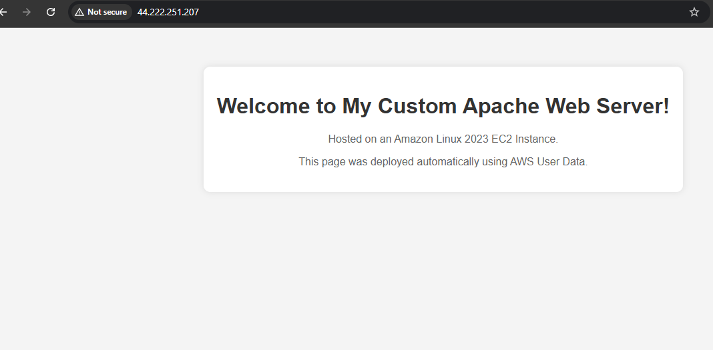

# Custom Apache Web Server on AWS EC2

This repository contains the Terraform configuration to automatically provision and deploy a custom Apache web server hosted on an **Amazon Linux 2023** EC2 instance.

The deployment leverages AWS User Data to bootstrap the instance, install the Apache HTTP Server (`httpd`), and serve a custom welcome page upon initialization.

## Features

* **Infrastructure as Code (IaC):** Fully managed via Terraform.
* **Automated Bootstrap:** Uses AWS User Data to configure the OS, install Apache, and deploy the web page without manual SSH intervention.
* **Amazon Linux 2023:** Built on AWS's latest, optimized Linux distribution.

---

## Prerequisites

Before you begin, ensure you have the following installed and configured:

1. [Terraform](https://www.terraform.io/downloads.html) (v1.0.0+)
2. [AWS CLI](https://aws.amazon.com/cli/) configured with appropriate IAM permissions.
3. An AWS VPC and Subnet ID where the EC2 instance will reside.

---

## Repository Structure

```text
.
├── main.tf          # Main Terraform configuration (Provider, EC2, Security Groups)
├── variables.tf     # Input variables (Instance type, AMI, region, etc.)
├── outputs.tf       # Outputs (Public IP / DNS of the web server)
├── userdata.sh      # Bash script to install Apache and create the index.html
└── README.md        # This file

```

---

## Usage Instructions

### 1. Clone the Repository

```bash
git clone <your-repo-url>
cd <your-repo-folder>

```

### 2. Initialize Terraform

Initialize the working directory containing Terraform configuration files to download the necessary providers.

```bash
terraform init

```

### 3. Review the Execution Plan

Generate and review an execution plan to see what resources Terraform will create.

```bash
terraform plan

```

### 4. Deploy the Infrastructure

Apply the changes to create the EC2 instance and security groups in your AWS account.

```bash
terraform apply

```

### 5. Access the Web Server

Once the apply complete screen finishes, Terraform will output the public IP address of your new instance.

Copy the IP address and paste it into your browser:

```text
http://<EC2_PUBLIC_IP>

```


> **Note:** It may take 1–2 minutes after the Terraform deployment finishes for the AWS User Data script to complete installing Apache and rendering the page.

---

## Clean Up

To tear down the infrastructure and avoid incurring unwanted AWS charges, run:

```bash
terraform destroy

```