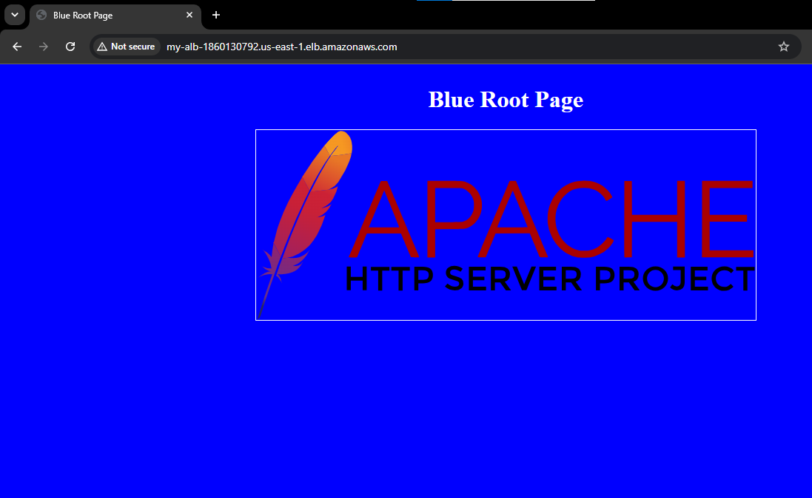
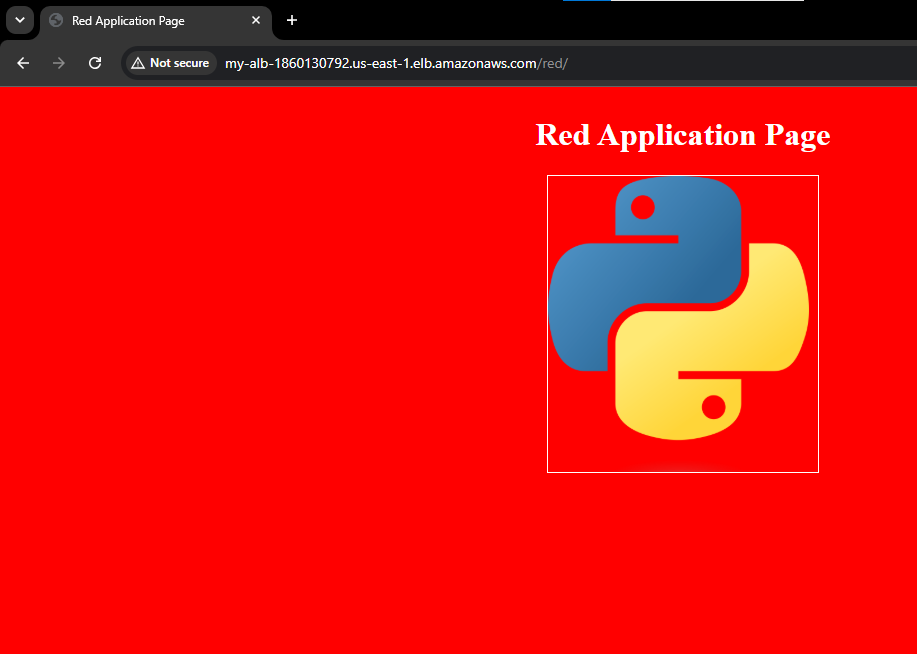
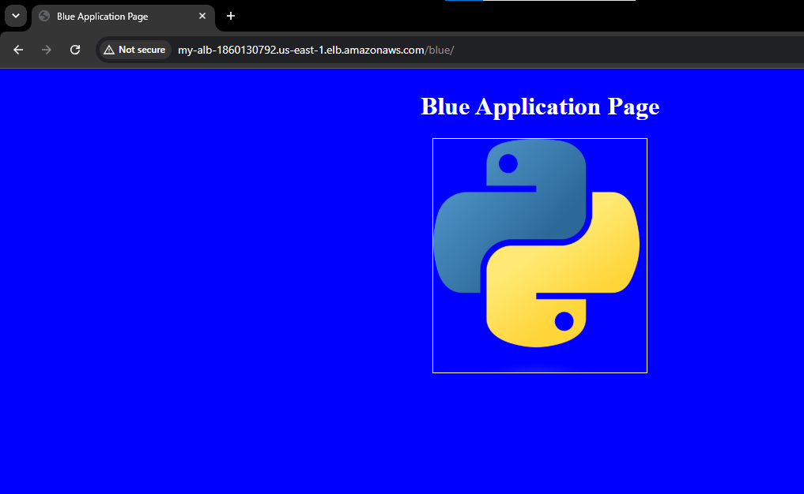

# AWS Load Balanced Architecture with Advanced Request Routing

## Project Overview
This project demonstrates how to deploy a scalable, highly available web architecture on AWS using Terraform. It features a simple website hosted on EC2 instances, placed behind an Application Load Balancer (ALB). The core objective is to configure **Path-based** routing rules to dynamically route traffic based on URL paths

* **Path-based routing:** Forwards requests to specific target groups based on the URL path (e.g., `/red*` or `/blue*`).

---

## Architecture Components
The infrastructure is provisioned using Terraform and consists of the following AWS services:

* **Amazon VPC:** Multi-AZ deployment (subnets in `us-east-1a` and `us-east-1b`) for high availability.
* **Amazon EC2:** Two web servers ("Red" and "Blue" on `t2.micro` instances) hosting custom HTML/CSS content.
* **Amazon S3:** A unique bucket (e.g., `arr-bucket-123456`) used to store the website code and assets, securely retrieved by the EC2 instances on boot via user-data scripts.
* **IAM Roles:** An instance profile attached to the EC2 instances granting read-only access to the S3 bucket.
* **Security Groups:** A security group configured to allow inbound HTTP (port 80) traffic from anywhere (0.0.0.0/0).
* **Application Load Balancer (ALB):** An internet-facing load balancerrouting traffic across multiple Availability Zones.
* **Target Groups:** Two distinct groups ("Red" and "Blue") with dedicated health checks monitoring `/red/index.html` and `/blue/index.html` respectively.

---

## Prerequisites
To deploy this project, you will need:
* An active **AWS Free Tier Account**.
* **Terraform** installed on your local machine.
* Basic knowledge of the AWS Console and Terraform module structures.
---

## Terraform Module Structure
This project utilizes a modular approach for clean and reusable Infrastructure as Code (IaC):

    .
    ├── main.tf
    ├── variables.tf
    ├── outputs.tf
    ├── modules/
    │   ├── s3/              # S3 bucket for website code
    │   ├── ec2/             # Red and Blue instances + user-data bootstrapping
    │   └── alb/             # Application Load Balancer, Listeners, Target Groups

### Key Terraform Implementation Details:
* **Dynamic Target Groups:** Utilizes `for_each` loops to seamlessly create multiple target groups based on a map of configurations (Red and Blue).
* **Seamless Module Passing:** EC2 instance IDs are outputted as a map and passed directly into the ALB module to dynamically attach instances to their respective target groups without hardcoding.

---

## Path-Based Routing

Path-based routing (or URL-based routing) allows the Application Load Balancer to inspect the HTTP request and forward it to a specific Target Group based on the URL path. 

In this project, the ALB listener evaluates rules in priority order:
1.  **Rule 1 (Priority 1):** If the `Path Pattern` is `/red*`, traffic is forwarded to the **Red Target Group**.
2.  **Rule 2 (Priority 2):** If the `Path Pattern` is `/blue*`, traffic is forwarded to the **Blue Target Group**.
3.  **Default Rule:** If no path matches, it routes to a fallback destination.

**Testing:** Appending `/red` or `/blue` to the Load Balancer's DNS name in the web browser will route the request directly to the respective colored EC2 instance's custom web page.

---

## Usage Instructions

### 1. Clone the Repository

```bash
git clone <your-repo-url>
cd <your-repo-folder>

```

### 2. Initialize Terraform

Initialize the working directory containing Terraform configuration files to download the necessary providers.

```bash
terraform init

```

### 3. Review the Execution Plan

Generate and review an execution plan to see what resources Terraform will create.

```bash
terraform plan

```

### 4. Deploy the Infrastructure

Apply the changes to create the EC2 instance and security groups in your AWS account.

```bash
terraform apply

```

### 5. Access the Load Balancer

Once the apply complete screen finishes, Terraform will output the public DNS address of your new Load balancer.

Copy the DNS address and paste it into your browser:

```text
http://<PUBLIC_DNS>

```
---
### Application Snapshots

Default listner


Path based route to /red


Path based route to /blue

---
